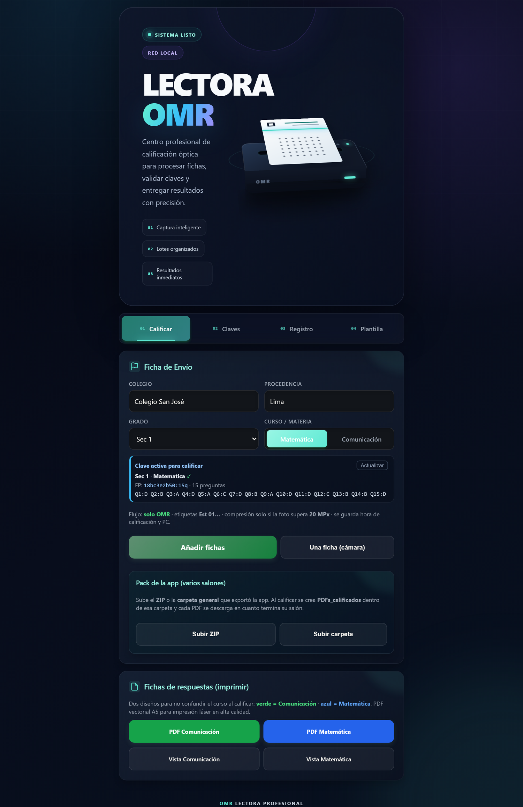
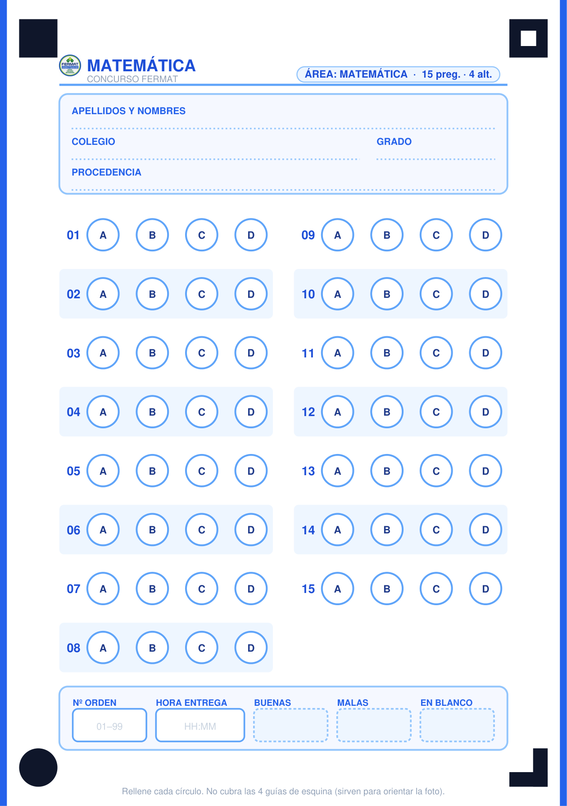
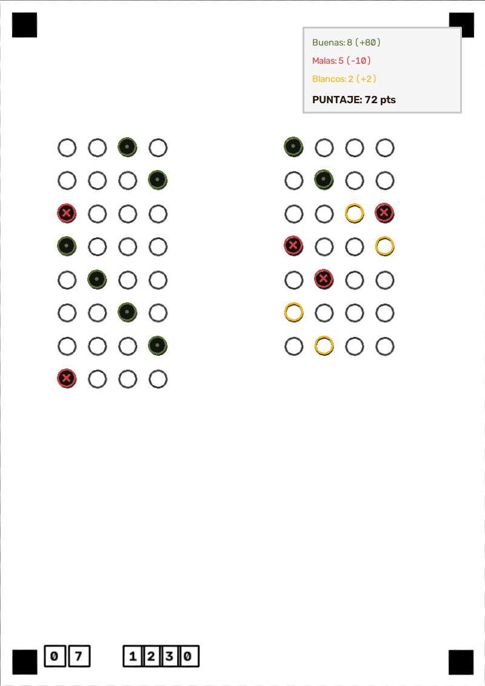

# OMR OCR SCAN

Lectora de fichas OMR para concursos y exámenes. Fotografías o lotes desde el celular, calificación automática y PDF por salón.

**Versión actual: 2.0** · Flask + OpenCV + app Android **Lectora OMR** · Licencia [MIT](LICENSE)

[](LICENSE)
[](https://www.python.org/)
[](omr-camera/)

Autor: **Alberto Brayan** (A.B.M.R.) · Perú  
[LinkedIn](https://www.linkedin.com/in/alberto-brayan/) · [alberto.morote.26@unsch.edu.pe](mailto:alberto.morote.26@unsch.edu.pe)

---

## Qué hace

1. Genera fichas OMR A5 (Comunicación o Matemática) listas para imprimir.
2. La app Android captura las fichas por salón y curso y exporta un ZIP.
3. El servidor Flask alinea la hoja, lee las burbujas y califica con la clave.
4. Entrega un reporte Excel y un PDF del lote.

## Capturas

| Dashboard web | Ficha A5 | Resultado |
|---|---|---|
|  |  |  |

## Requisitos

- Python 3.12 o superior
- Windows (el OCR opcional de encabezados usa APIs de Windows)
- Android 8+ para la app de captura

## Instalación (app web)

```bash
git clone https://github.com/alber-brayan/omr-ocr-scan.git
cd omr-ocr-scan
python -m venv .venv
.venv\Scripts\activate
pip install -r requirements.txt
python app.py
```

Abrir http://localhost:5000

El Excel de ejemplo `configuracion_ejemplo.xlsx` trae la estructura de alumnos y claves. El branding de muestra es **CONCURSO FERMAT**; cámbialo en `settings_config.json`.

## App Android (Lectora OMR)

Proyecto en [`omr-camera/`](omr-camera/).

1. Abre la carpeta en Android Studio.
2. Copia `omr-camera/local.properties.example` a `local.properties` y apunta al SDK.
3. Compila e instala en el teléfono.

El APK de la versión 2.0 se publica en [Releases](../../releases).

Flujo: elegir salón y curso → fotografiar fichas → exportar ZIP → calificar en la app web (pestaña de packs) o con `CalificarPack.bat`.

## Ficha de ejemplo

En [`samples/`](samples/):

- `ficha_matematica_a5.pdf`
- `ficha_comunicacion_a5.pdf`

Imprimir en **A5 a escala 100%**, sin «ajustar a página». Las marcas de esquina tienen forma distinta (sólido, marco, círculo, ele) para corregir rotación.

## Versiones

El código actual en la raíz es **v2.0**. Las versiones anteriores quedan en `archive/` y en la etiqueta `v1.5`.

| Versión | Carpeta | Contenido |
|---|---|---|
| 0.1 | [`archive/v0.1`](archive/v0.1) | Primera app Flask (lectura y calificación) |
| 1.0 | [`archive/v1.0`](archive/v1.0) | Lotes, packs, extracción de claves |
| 1.5 | etiqueta `v1.5` | Flask + app Android + modelo `mnist.onnx` |
| **2.0** | raíz + [`omr-camera/`](omr-camera/) | Interfaz web en una columna y app Android con el frente nuevo |

## Estructura

```
app.py                 servidor Flask
omr_processor.py       lectura OMR y calificación
omr_align.py           alineación de la ficha
sheet_pdf.py           PDF vectorial A5
omr_pack.py            packs por salón/curso
calificar_pack.py      calificar un ZIP desde consola
omr-camera/            app Android Lectora OMR
mnist.onnx             modelo de dígitos (opcional)
samples/               fichas de ejemplo
archive/               v0.1 y v1.0
```

## Licencia

[MIT](LICENSE) © 2026 Alberto Brayan.
